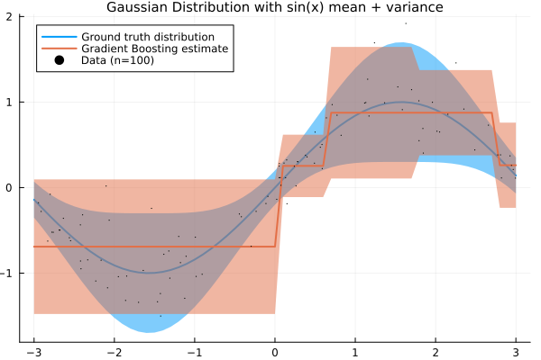
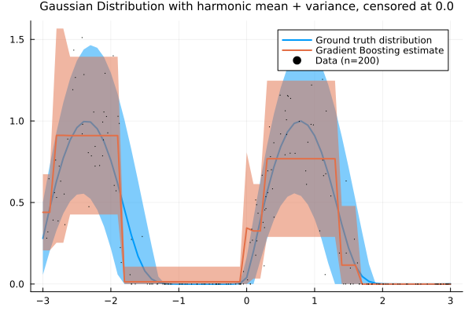
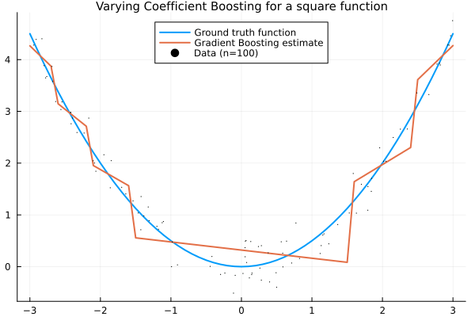

# AdvancedBoosting.jl

[](https://github.com/SaremS/AdvancedBoosting.jl/actions/workflows/docs.yml?query=branch%3Amain)
[](https://sarems.github.io/AdvancedBoosting.jl/)
[](https://github.com/SaremS/AdvancedBoosting.jl/actions/workflows/CI.yml?query=branch%3Amain)


Experimental package for various Gradient Boosting models. Currently developed on [Julia 1.10-rc2](https://github.com/JuliaLang/julia/tree/v1.10.0-rc2)

## Examples

1. [Gaussian conditional distribution](#gaussian-conditional-distribution)
2. [Censored Gaussian conditional distribution](#censored-gaussian-conditional-distribution)
3. [Varying Coefficient boosting](#varying-coefficient-boosting)

### Gaussian conditional distribution
Here, we model the conditional mean and standard deivation as Gradient Boosting models, i.e.

$$
p(y|\mathbf{x})=\mathcal{N}(y|f_1(\mathbf{x}),s(f_2(\mathbf{x})))
$$

where $f_1,f_2$ are individual Gradient Boosting models and $s$ is the softplus function

$$
\text{softplus}(x)=\log\left(\exp(x)+1\right)
$$

```
using AdvancedBoosting, Random, Plots
import Distributions.Normal, Distributions.mean, Distributions.std

Random.seed!(321);

X = rand(100,1) .* 6 .- 3;
y = sin.(X) .+ randn(100,1) .* (0.25 .* abs.(sin.(X)) .+ 0.1);


model = DistributionalBoostingModel(
    Normal, #conditional distribution shoud be normal
    [RootBoostingModel(1,3), RootBoostingModel(1,3)], #both conditional mean and standard deviation are modelled by GradientBoosting
    MultiTransform(
        [IdentityTransform([1]), #mean model output stay as is
         SoftplusTransform([2])  #stddev model output is mapped to the positive, non-zero reals
    ]) 
);

fit!(model, X, y[:])

lines = collect(-3:0.1:3)[:,:];
pred_dists = model(lines);

p1 = plot();

plot!(p1
    lines[:], sin.(lines[:]),
    ribbon = 2 .* (0.25 .* sin.(lines[:]).^2 .+ 0.1),
    label="Ground truth distribution",
    title="Gaussian Distribution with sin(x) mean + variance", 
    titlefontsize=10,
    fmt=:png,
    lw=2
);
plot!(p1, 
    lines[:],mean.(pred_dists),
    ribbon = 2 .* std.(pred_dists),
    label="Gradient Boosting estimate", lw=2
);
scatter!(p1,
    X[:],y[:],
    markersize = 0.25,
    label = "Data (n=100)"
);
```




### Censored Gaussian conditional distribution
Same as above, but now we have the Gaussian distribution censored at y=0, i.e.

$$
p(y|\mathbf{x})=\Phi(0|f_1(\mathbf{x}),s(f_2(\mathbf{x})))\cdot\mathbb{I}(y=0) + (1-\Phi(0|f_1(\mathbf{x}),s(f_2(\mathbf{x}))))\cdot\mathcal{N}(y|f_1(\mathbf{x}),s(f_2(\mathbf{x})))\cdot\mathbb{I}(y>0)
$$

```
import Distributions.Normal, Distributions.censored
Random.seed!(321)

X = rand(200,1) .* 6 .- 3
f(x) = censored(Normal(sin( 2 * x), 0.25*abs(sin(x))+0.1), lower=0.0)
y = rand.(f.(X))

#define custom distribution to match our type definition
import Distributions.ContinuousUnivariateDistribution, Distributions.logpdf, Distributions.mean, Distributions.quantile

struct ZeroCensoredNormal <: ContinuousUnivariateDistribution
    mu
    sigma
end

logpdf(m::ZeroCensoredNormal, y) = logpdf(censored(Normal(m.mu, m.sigma), lower=0.0), y)
mean(m::ZeroCensoredNormal) = mean(censored(Normal(m.mu, m.sigma), lower=0.0))
quantile(m::ZeroCensoredNormal, p) = quantile(censored(Normal(m.mu, m.sigma), lower=0.0),p)


model = DistributionalBoostingModel(
    ZeroCensoredNormal,
    [RootBoostingModel(1,5),RootBoostingModel(1,5)],
    MultiTransform([IdentityTransform([1]), SoftplusTransform([2])])
)

fit!(model, X, y[:])

lines = collect(-3:0.1:3)[:,:]
pred_dists = model(lines)
mean_pred = mean.(pred_dists)
ribbon_pred = (mean_pred .- quantile.(pred_dists,0.05), quantile.(pred_dists,0.95) .- mean_pred)

line_dists = f.(lines)
mean_line = mean.(line_dists)
ribbon_line = (mean_line .- quantile.(line_dists,0.05), quantile.(line_dists,0.95) .- mean_line)


p1 = plot()

plot!(p1,lines[:], mean_line, ribbon = ribbon_line, label="Ground truth distribution", title="Gaussian Distribution with harmonic mean + variance, censored at 0.0", 
    titlefontsize=10, fmt=:png, lw=2)
plot!(p1, lines[:], mean_pred, ribbon = ribbon_pred, label="Gradient Boosting estimate", lw=2)
scatter!(p1, X[:],y[:], markersize = 0.25, label = "Data (n=200)")
```



### Varying Coefficient Boosting 
Model the coefficients of a linear model as gradient boosted, varying coefficients:

$$
y=\alpha+f_1(\mathbf{x})\cdot\mathbf{x}_{(1)}+\cdots+f_M(\mathbf{x})\cdot\mathbf{x}_{(M)}
$$

where $\mathbf{x}\in\mathbb{R}^M$ and $f_1,...,f_M$ are individual Gradient Boosting models. 

```
using AdvancedBoosting, Random, Plots
import Distributions.Normal, Distributions.mean 

Random.seed!(321);

X = rand(100,1) .* 6 .- 3
f(x) = Normal(0.5*x^2, 0.25)
y = rand.(f.(X))

model = VaryingCoefficientBoostingModel(
    [RootBoostingModel(1,5)],
    VaryingCoefficientTransform()
);

fit!(model, X, y[:])

lines = collect(-3:0.1:3)[:,:];
predictions = model(lines);

p1 = plot();

plot!(p1, lines[:], mean.(f.(lines[:])),
      label="Ground truth function",
      title="Varying Coefficient Boosting for a square function", 
      titlefontsize=10,
      fmt=:png,
      lw=2,
      legend=:top);
plot!(p1, lines[:], predictions,
      label="Gradient Boosting estimate",
      lw=2);
scatter!(p1, X[:], y[:],
         markersize=0.25,
         label="Data (n=100)");
```

